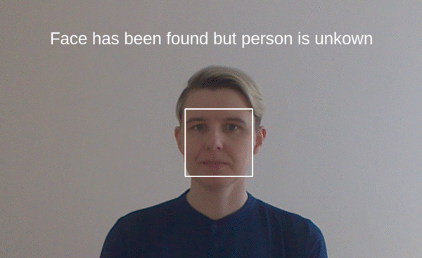

# About

Face recognition on live camera images. Runs smoothly on NVIDIA Jetson Nano
(camera image 25 frames/second, face recognition updated 2 times/second).  



## What can you use this for?

I use it for the [Face recognition game](https://krasch.io/projects/face_recognition_game/): Letting people explore what parts of a face are 
important for a face recognition system by making them wear funny masks (see gif).

You can also adapt the code and use it for all other kinds of face recognition / live 
 computer vision demos.

## Background 

This project was inspired by Adam Geitgey’s fantastic tutorial 
[Build a Hardware-based Face Recognition System for $150 with the Nvidia Jetson Nano and Python](https://medium.com/@ageitgey/build-a-hardware-based-face-recognition-system-for-150-with-the-nvidia-jetson-nano-and-python-a25cb8c891fd).

I have written a blogpost about [my motivation for building the Face recognition game](https://krasch.io/projects/face_recognition_game/).

Compared to Adam Geitgey’s implementation, I added/changed a bunch of things ([Reasons for these changes](https://krasch.io/projects/face_recognition_game/details.html)):

* multi-process implementation to make everything run more smoothly
* button press to add person to face database (rather than automatically adding them first
time they look into the camera (which does not work all that well))
* stars to visualise match quality 

# Pre-requisites

You can run this on a computer (with built-in camera or USB camera) and on the NVIDIA Jetson Nano with
Rasperry Pi camera ([hardware description](https://medium.com/@ageitgey/build-a-hardware-based-face-recognition-system-for-150-with-the-nvidia-jetson-nano-and-python-a25cb8c891fd)).

# Installation (on Jetson Nano)

TODO, for now, follow [Adam Geitgey's installation instructions](https://medium.com/@ageitgey/build-a-hardware-based-face-recognition-system-for-150-with-the-nvidia-jetson-nano-and-python-a25cb8c891fd).

```
sh download_models.sh
```
 
# Installation (on normal computer)

Python >= 3.7

```
sudo apt-get install libopenblas-dev liblapack-dev 
pip install -r requirements.txt  
sh download_models.sh
```

# Configuration

```
cp config.yaml.sample config.yaml
```

## I want to use an internal or USB camera

In config.yaml, set `source: camera` and change the `source_setting -> camera->location` entry to
the id of your camera. You can find the camera id by trial and error, try -1, 0, 1, etc till it works,

## I want to use the Rasperry Pi camera on my jetson

In config.yaml, set `source: camera_jetson`.

## I want to use a pre-recorded video 

In config.yaml, set `source: prerecorded` and change the `source_setting -> prerecorded->location` entry
to the file path of the video.

## I want to configure all kinds of other things

There is lot's of documentation directly in `config.yaml`.

# Startup

```
python main.py
```

# Keyboard commands

```
q: quit
c: reload the config from file (if you changed it)
d: toggle debug mode
r: register person(s) 
u: unregister last registered person(s)
```

You can change these in `game/game.py`.


